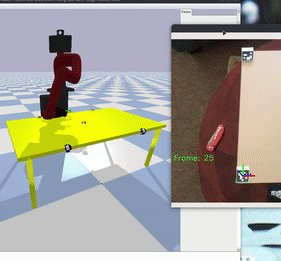

# Projects
{: .no_toc}

Here is a collection of various projects that I'm working on.

## Table of contents
{: .no_toc .text-delta }

1. TOC
{:toc}

---

## This section is a work in progress
{: .no_toc}

### Teleoperation of Sawyer Manipulator
Utilized Aruco Tags, OpenCV, and the Cairo simulator to operate a Sawyer Manipulator with a bird's eye view RGB camera feed.

  

### Spot Controller
Implemented Chelsea Finn's *Model Agnostic Meta Learning* paper to control Boston Dynamics Spot Robot.

  
